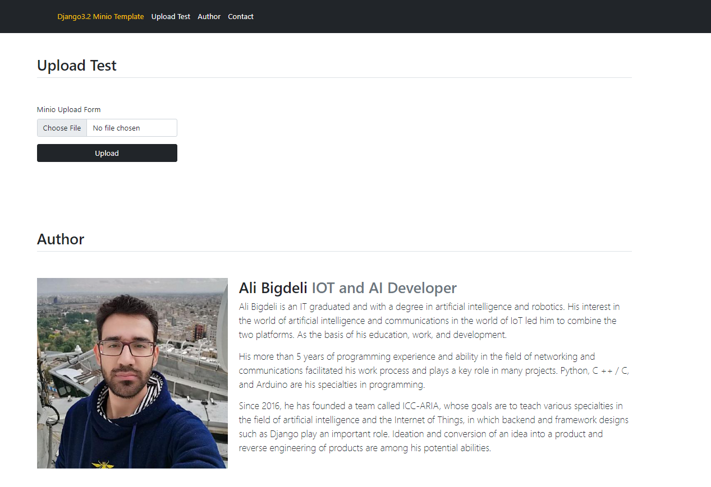
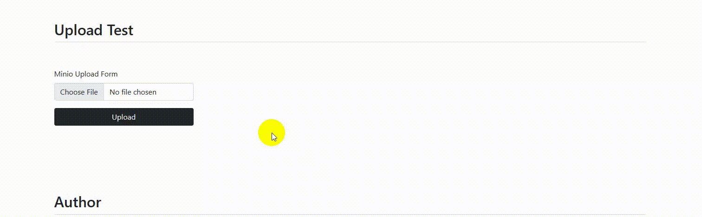
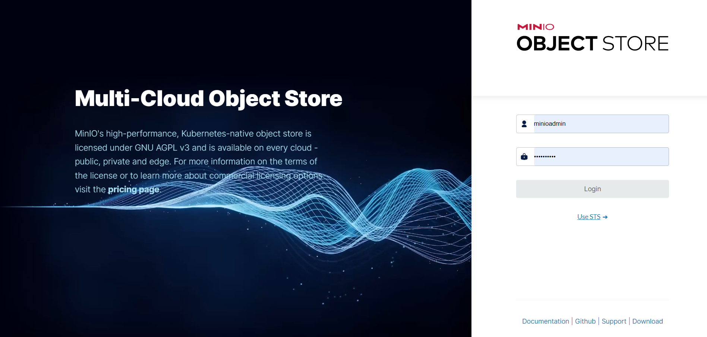
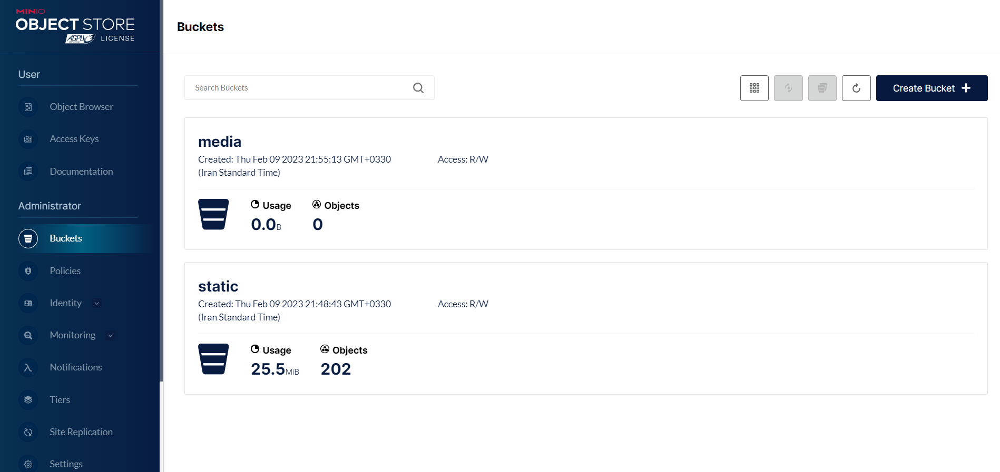
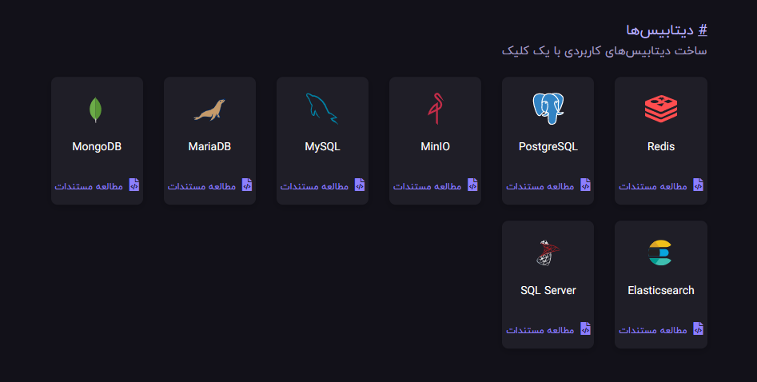
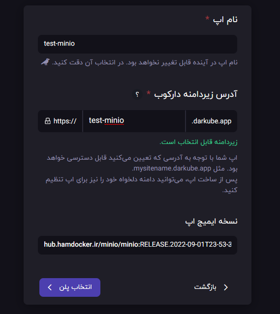
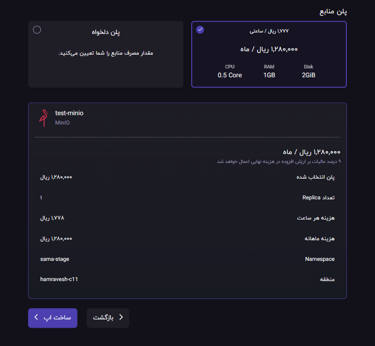
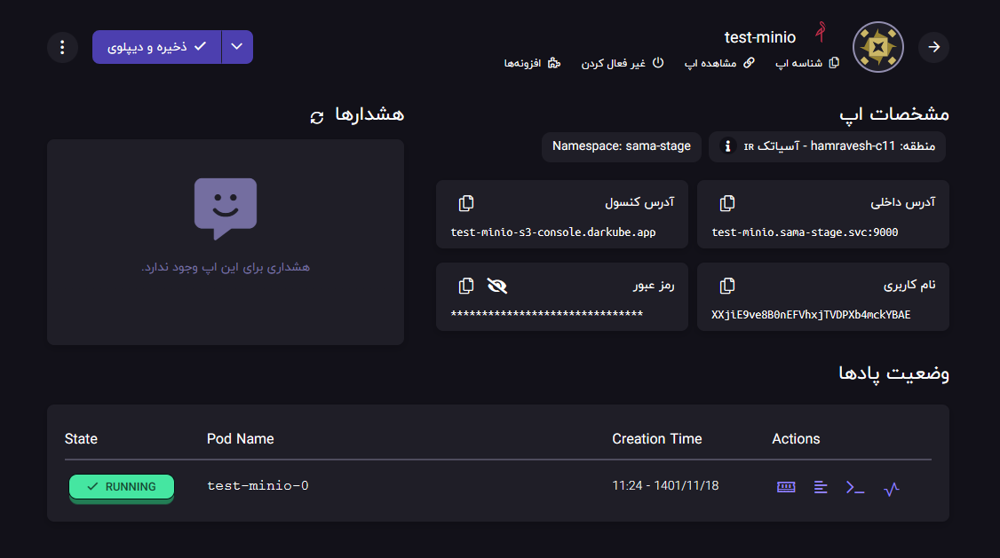
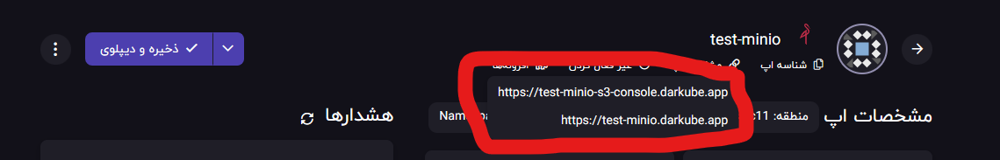
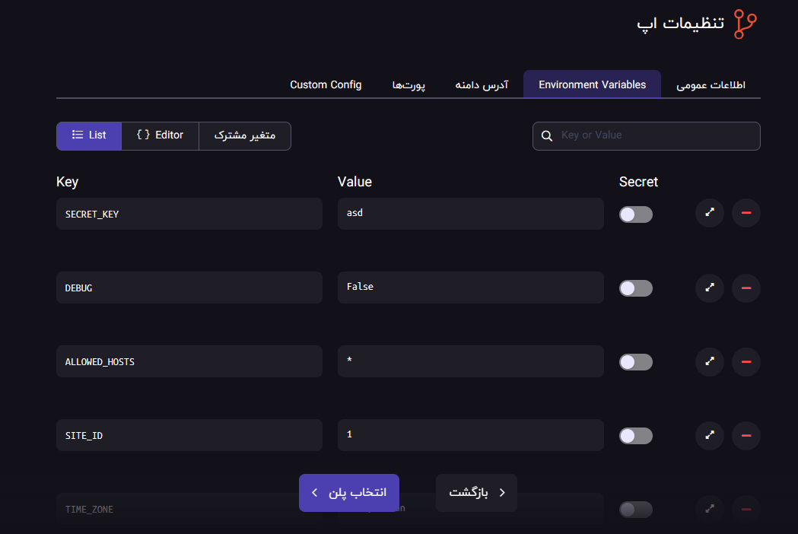

<div align="center">

<h1 align="center">Django3.2 Hamravesh Minio Template</h1>
<h3 align="center">Sample Project to use hamravesh service provider for django plus minio file storage app</h3>
</div>
<p align="center">
<a href="https://www.python.org" target="_blank">  </a>
<a href="https://www.djangoproject.com/" target="_blank">  </a> 
<a href="https://www.docker.com/" target="_blank">  </a>
<a href="https://www.postgresql.org" target="_blank">  </a>
<a href="https://www.nginx.com" target="_blank">  </a>
<a href="https://git-scm.com/" target="_blank">  </a>
<a href="https://hamravesh.com/" target="_blank">  </a>
<a href="https://minio.io/" target="_blank">  </a>
</p>

# Guideline
- [Guideline](#guideline)
- [Goal](#goal)
- [Video Instructions](#video-instructions)
- [Development usage](#development-usage)
  - [Clone the repo](#clone-the-repo)
  - [Enviroment Varibales](#enviroment-varibales)
  - [Build everything](#build-everything)
  - [Note](#note)
  - [Check it out in a browser](#check-it-out-in-a-browser)
- [Testing Usage](#testing-usage)
  - [running all tests](#running-all-tests)
  - [testing minio storage](#testing-minio-storage)
- [Hamravesh deployment](#hamravesh-deployment)
  - [0- Create an account](#0--create-an-account)
  - [2- Setup database](#2--setup-database)
  - [3- setup minio instance](#3--setup-minio-instance)
    - [1- choose the minio instance](#1--choose-the-minio-instance)
    - [2- setup address and name](#2--setup-address-and-name)
    - [3- choose the right plan and resource](#3--choose-the-right-plan-and-resource)
    - [4- copy the credentials](#4--copy-the-credentials)
  - [4- Setup django app](#4--setup-django-app)
- [CICD Deployment](#cicd-deployment)
  - [Github CICD](#github-cicd)
  - [Gitlab/Hamgit CICD](#gitlabhamgit-cicd)
- [Sentry Logger](#sentry-logger)
- [License](#license)
- [Bugs](#bugs)

# Goal
This project main goal is to provide a simple way to deploy a django project into hamravesh service provider.

# Video Instructions
<div align="center" ></div>

# Development usage
You'll need to have [Docker installed](https://docs.docker.com/get-docker/).
It's available on Windows, macOS and most distros of Linux. 

If you're using Windows, it will be expected that you're following along inside
of [WSL or WSL
2](https://nickjanetakis.com/blog/a-linux-dev-environment-on-windows-with-wsl-2-docker-desktop-and-more).

That's because we're going to be running shell commands. You can always modify
these commands for PowerShell if you want.


## Clone the repo
Clone this repo anywhere you want and move into the directory:
```bash
git clone https://github.com/AliBigdeli/Django-Hamravesh-Docker-Minio-Template.git
```

## Enviroment Varibales
enviroment varibales are included in docker-compose.yml file for debugging mode and you are free to change commands inside:

```yaml
services:
  backend:
  command: sh -c "python manage.py check_database && \ 
                      python manage.py collectstatic --noinput && \
                      yes | python manage.py makemigrations  && \
                      yes | python manage.py migrate  && \                    
                      python manage.py runserver 0.0.0.0:8000"
    environment:      
      - DEBUG=True
```
Note: in order for minio to work properly and serve files as statics you have to collect the statics of the project.

also you can edit your minio service configurations inside the docker-compose.yml file:
```yaml
  minio:
    image: minio/minio
    container_name: minio
    expose:
      - 9000
      - 9001
    ports:
      - "9000:9000"
      - "9001:9001"
    volumes:
      - './minio/data:/data'
    environment:
      MINIO_ROOT_USER: minioadmin
      MINIO_ROOT_PASSWORD: minioadmin
    command: server --console-address ":9001" /data

```

## Build everything

The first time you run this it's going to take 5-10 minutes depending on your
internet connection speed and computer's hardware specs. That's because it's
going to download a few Docker images such as minio and build the Python + requirements dependencies. and dont forget to create a .env file inside dev folder for django and postgres with the samples.

```bash
docker compose up --build
```

Now that everything is built and running we can treat it like any other Django
app.

## Note

If you receive an error about a port being in use? Chances are it's because
something on your machine is already running on port 8000. then you have to change the docker-compose.yml file according to your needs.

also 
feel free to change the default configurations provided inside settings.py:
```python
# Minio storage
## global config
DEFAULT_FILE_STORAGE = "minio_storage.storage.MinioMediaStorage"
STATICFILES_STORAGE = "minio_storage.storage.MinioStaticStorage"
MINIO_STORAGE_ENDPOINT = config('MINIO_STORAGE_ENDPOINT', default="minio:9000")
MINIO_EXTERNAL_STORAGE_ENDPOINT= config('MINIO_EXTERNAL_STORAGE_ENDPOINT', default="http://127.0.0.1:9000")

## security configs
MINIO_STORAGE_ACCESS_KEY = config('MINIO_STORAGE_ACCESS_KEY', default="minioadmin")
MINIO_STORAGE_SECRET_KEY = config('MINIO_STORAGE_SECRET_KEY', default="minioadmin")
MINIO_STORAGE_USE_HTTPS = config('MINIO_STORAGE_USE_HTTPS',cast=bool, default="False")

## static files config
MINIO_STORAGE_MEDIA_BUCKET_NAME = config('MINIO_STORAGE_MEDIA_BUCKET_NAME',default='media')
MINIO_STORAGE_MEDIA_USE_PRESIGNED = True
MINIO_STORAGE_AUTO_CREATE_MEDIA_BUCKET = True

## media files config
MINIO_STORAGE_STATIC_BUCKET_NAME = config('MINIO_STORAGE_STATIC_BUCKET_NAME',default='static')
MINIO_STORAGE_STATIC_USE_PRESIGNED = True
MINIO_STORAGE_AUTO_CREATE_STATIC_BUCKET = True

# changing base url schema for static and media serve
# by default in dev mode it will look for localhost port 9000 you can configure another when using online

MINIO_STORAGE_STATIC_URL = config('MINIO_STORAGE_STATIC_URL',f'{MINIO_EXTERNAL_STORAGE_ENDPOINT}/{MINIO_STORAGE_STATIC_BUCKET_NAME}')
MINIO_STORAGE_MEDIA_URL = config('MINIO_STORAGE_MEDIA_URL',f'{MINIO_EXTERNAL_STORAGE_ENDPOINT}/{MINIO_STORAGE_MEDIA_BUCKET_NAME}')

```

## Check it out in a browser

Visit <http://localhost:8000> in your favorite browser.

<div align="center" ></div>

# Testing Usage
## running all tests
```bash
docker compose run --rm backend sh -c " black -l 79 && flake8 && python manage.py test" -v core:/app
```
or
```bash
docker compose exec backend sh -c sh -c " black -l 79 && flake8 && python manage.py test" 
```

## testing minio storage
in order to test the storage workflow all you have to do is to open the root address of the porject, then try to upload a file and then check to see how it works.

<div align="center" ></div>

also you can go ahead and open minio dashboard and login with credentials which is minioadmin  as username and password:
<div align="center" ></div>


 and see the buckets contents.
<div align="center" ></div>

# Hamravesh deployment

## 0- Create an account
for this section please follow the instructions for General Deployment of hamravesh projects provided here:

<https://github.com/AliBigdeli/Django-Hamravesh-Docker-Template#0--create-an-account>

## 2- Setup database
for this section please follow the instructions for General Deployment of hamravesh projects provided here:

<https://github.com/AliBigdeli/Django-Hamravesh-Docker-Template#2--setup-database>

## 3- setup minio instance
follow the provided steps to finish this section.

### 1- choose the minio instance
first of all head to the database section of ceating apps and choose minio as file storage instance to be created.

<div align="center" ></div>

### 2- setup address and name
then choose a preferred naming for the app and address.
<div align="center" ></div>
Note: versions of the minio might be changing in future but this process will still be the same.

### 3- choose the right plan and resource
for you project you have to decide how much disk your gonna need so pick the right amount and proceed.
<div align="center" ></div>


### 4- copy the credentials
in this part after successful running of the instance we are going to need the information for connecting to the minio storage:
<div align="center" ></div>
remember that you can access to your minio admin dashboard with another url which hamravesh will provide and you will gonna use the one which you added as the serving url for the project.
<div align="center" ></div>


## 4- Setup django app
for this section please follow the instructions for General Deployment of hamravesh projects provided here:

<https://github.com/AliBigdeli/Django-Hamravesh-Docker-Template#3--setup-django-app>

Note: the only difference is you have to add these environment variables to the project in order to serve files from minio:
```properties
MINIO_STORAGE_ENDPOINT=test-minio.bigdeliali3.svc:9000
MINIO_STORAGE_ACCESS_KEY=jUPNo7aXZegW5c2ZhRw0M4jMqWiRaeRO
MINIO_STORAGE_SECRET_KEY=v4bzhiT3Hfn3eC5GnMM40qzUnPa2DSvO
MINIO_STORAGE_USE_HTTPS=False
MINIO_EXTERNAL_STORAGE_ENDPOINT=https://test-minio.darkube.app
```
<div align="center" ></div>


# CICD Deployment
For the sake of continuous integration and deployment i have provided two samples for github and gitlab/hamgit for you.
but there will be some configurations to be added for building and deploying purposes.

## Github CICD
will be provided soon

## Gitlab/Hamgit CICD
for this section please follow the instructions for General Deployment of hamravesh projects provided here:

<https://github.com/AliBigdeli/Django-Hamravesh-Docker-Template#gitlabhamgit-cicd>


# Sentry Logger
for this section please follow the instructions for General Deployment of hamravesh projects provided here:

<https://github.com/AliBigdeli/Django-Hamravesh-Docker-Template#sentry-logger>
# License
MIT.


# Bugs
Feel free to let me know if something needs to be fixed. or even any features seems to be needed in this repo.
